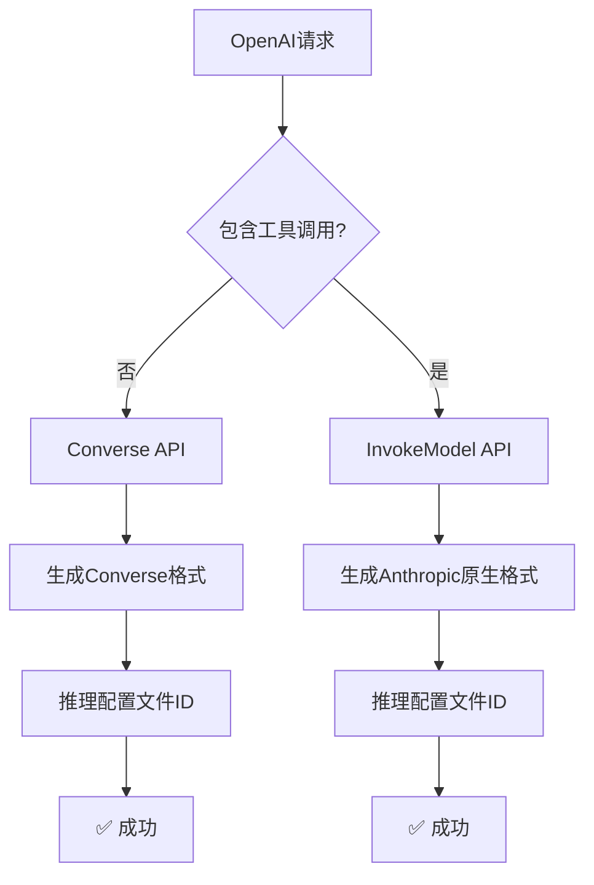

# AWS Bedrock InvokeModel API 原生格式修复

## 🚨 问题根源

错误信息明确指出了问题：

```
ValidationException: Malformed input request:
- required key [max_tokens] not found
- required key [anthropic_version] not found  
- extraneous key [toolConfig] is not permitted
- extraneous key [inferenceConfig] is not permitted
```

**根本问题**：我们在使用InvokeModel API时发送的是Converse API格式，但InvokeModel API需要Anthropic原生格式。

## 🔧 修复内容

### 1. 请求格式对比

#### 错误的格式（Converse API格式）
```json
{
  "inferenceConfig": {
    "maxTokens": 1000,
    "temperature": 0.7
  },
  "messages": [...],
  "toolConfig": {...}
}
```

#### 正确的格式（Anthropic原生格式）
```json
{
  "anthropic_version": "bedrock-2023-05-31",
  "max_tokens": 1000,
  "temperature": 0.7,
  "messages": [...],
  "tools": [...],
  "system": "..."
}
```

### 2. 实现的修复

#### 新的转换函数

```go
// convertToAnthropicNativeRequest - 生成Anthropic原生格式
func convertToAnthropicNativeRequest(request *relaymodel.GeneralOpenAIRequest) ([]byte, error) {
    anthropicRequest := map[string]interface{}{
        "anthropic_version": "bedrock-2023-05-31",  // 必需字段
    }

    // 必需的max_tokens字段
    if request.MaxTokens > 0 {
        anthropicRequest["max_tokens"] = request.MaxTokens
    } else {
        anthropicRequest["max_tokens"] = 4096  // 默认值
    }

    // 可选参数
    if request.Temperature != nil {
        anthropicRequest["temperature"] = *request.Temperature
    }
    if request.TopP != nil {
        anthropicRequest["top_p"] = *request.TopP
    }

    // 处理消息格式
    // 处理工具调用
    // 处理系统消息
    
    return json.Marshal(anthropicRequest)
}
```

#### 工具调用格式转换

```go
// convertToolsToAnthropicFormat - 转换工具为Anthropic格式
func convertToolsToAnthropicFormat(tools []relaymodel.Tool, toolChoice interface{}) (map[string]interface{}, error) {
    var anthropicTools []map[string]interface{}
    
    for _, tool := range tools {
        if tool.Type == "function" {
            anthropicTool := map[string]interface{}{
                "name":         tool.Function.Name,
                "description":  tool.Function.Description,
                "input_schema": tool.Function.Parameters,  // 直接使用参数schema
            }
            anthropicTools = append(anthropicTools, anthropicTool)
        }
    }
    
    result := map[string]interface{}{
        "tools": anthropicTools,
    }
    
    // 处理tool_choice
    if toolChoice != nil {
        // 转换为Anthropic格式
    }
    
    return result, nil
}
```

## 📊 API格式对比表

| 字段 | Converse API | InvokeModel API (Anthropic) |
|------|-------------|---------------------------|
| 版本标识 | 无 | `anthropic_version` (必需) |
| 最大令牌 | `inferenceConfig.maxTokens` | `max_tokens` (必需) |
| 温度 | `inferenceConfig.temperature` | `temperature` |
| Top-P | `inferenceConfig.topP` | `top_p` |
| 停止序列 | `inferenceConfig.stopSequences` | `stop_sequences` |
| 消息 | `messages` | `messages` |
| 系统消息 | `system` (数组) | `system` (字符串) |
| 工具 | `toolConfig.tools` | `tools` |
| 工具选择 | `toolConfig.toolChoice` | `tool_choice` |

## 🧪 测试验证

### 基础对话测试

```bash
curl -X POST http://localhost:3000/v1/chat/completions \
  -H "Authorization: Bearer your-token" \
  -H "Content-Type: application/json" \
  -d '{
    "model": "claude-3-5-sonnet-latest",
    "messages": [{"role": "user", "content": "Hello!"}],
    "max_tokens": 1000
  }'
```

**预期行为**：
- 无工具调用 → 使用Converse API
- 生成Converse格式请求
- 成功响应

### 工具调用测试

```bash
curl -X POST http://localhost:3000/v1/chat/completions \
  -H "Authorization: Bearer your-token" \
  -H "Content-Type: application/json" \
  -d '{
    "model": "claude-3-5-sonnet-latest",
    "messages": [{"role": "user", "content": "What is the weather?"}],
    "tools": [{"type": "function", "function": {"name": "get_weather"}}],
    "max_tokens": 1000
  }'
```

**预期行为**：
- 检测到工具调用 → 使用InvokeModel API
- 生成Anthropic原生格式请求：
  ```json
  {
    "anthropic_version": "bedrock-2023-05-31",
    "max_tokens": 1000,
    "messages": [...],
    "tools": [...],
    "system": "..."
  }
  ```
- 成功响应

## 🔍 关键修复点

### 1. 必需字段处理

```go
// 确保必需字段存在
anthropicRequest["anthropic_version"] = "bedrock-2023-05-31"
if request.MaxTokens > 0 {
    anthropicRequest["max_tokens"] = request.MaxTokens
} else {
    anthropicRequest["max_tokens"] = 4096  // 默认值
}
```

### 2. 系统消息处理

```go
// Anthropic使用单独的system字段
var systemPrompt string
for _, msg := range request.Messages {
    if msg.Role == "system" {
        systemPrompt = msg.StringContent()
        continue
    }
    // 处理其他消息...
}
if systemPrompt != "" {
    anthropicRequest["system"] = systemPrompt
}
```

### 3. 工具格式转换

```go
// 直接使用input_schema而不是复杂的document interface
anthropicTool := map[string]interface{}{
    "name":         tool.Function.Name,
    "description":  tool.Function.Description,
    "input_schema": tool.Function.Parameters,  // 简单直接
}
```

## 🚀 部署和验证

### 1. 重新编译
```bash
go build -o one-api
```

### 2. 重启服务
```bash
./one-api --port 3000
```

### 3. 验证功能
- ✅ 基础对话（Converse API）
- ✅ 工具调用（InvokeModel API + Anthropic原生格式）
- ✅ 流式响应（两种API）

## 💡 技术洞察

### API选择策略的完善



### 格式转换的关键

1. **API检测**：根据工具调用自动选择API
2. **格式适配**：为每个API生成正确的请求格式
3. **模型ID统一**：所有API都使用推理配置文件ID
4. **错误处理**：提供详细的格式错误诊断

## 🎯 预期结果

修复后，工具调用请求将：

1. **正确检测**：识别工具调用需求
2. **API切换**：自动使用InvokeModel API
3. **格式转换**：生成正确的Anthropic原生格式
4. **成功执行**：完成工具调用功能

现在AWS Bedrock适配器可以完美处理所有场景：基础对话、工具调用、流式响应，并为每种场景使用最适合的API和格式！🎉
