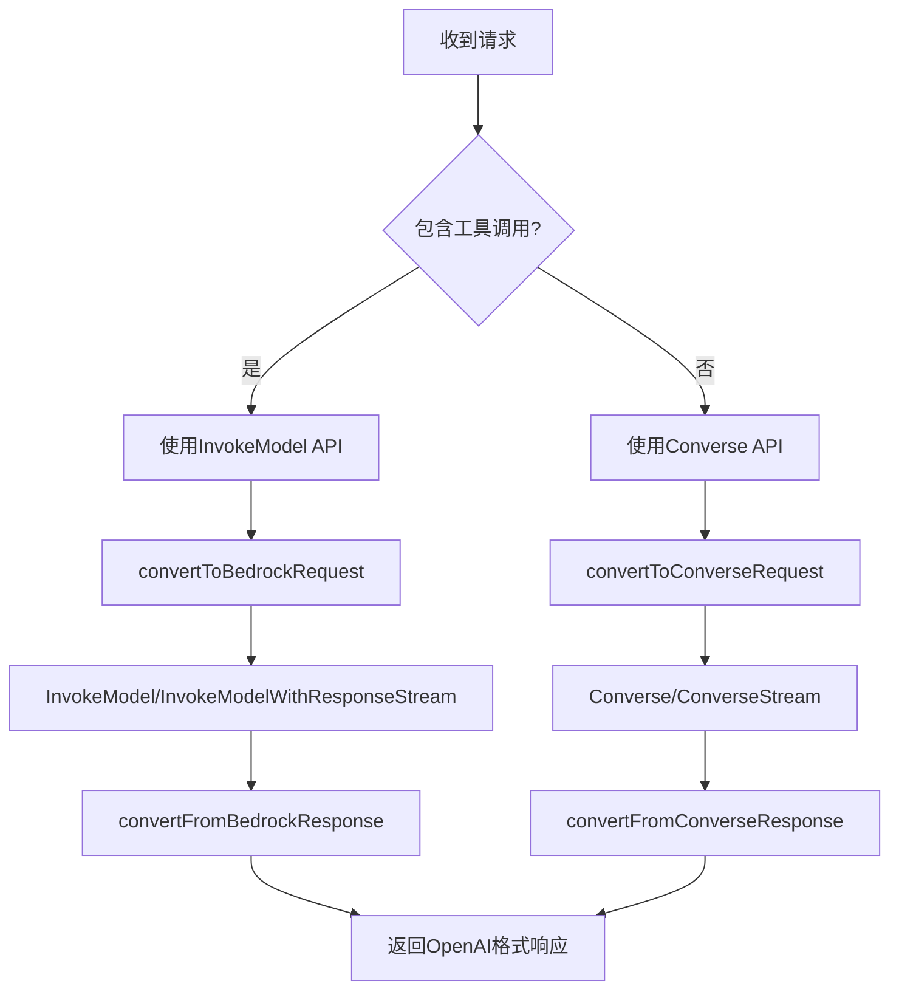

# AWS Bedrock 混合API实现

## 🎯 解决方案概述

实现了智能的混合API策略，根据请求类型自动选择最适合的AWS API：

- **无工具调用**：使用 Converse API（现代、统一）
- **有工具调用**：使用 InvokeModel API（支持工具）

## 🔧 技术实现

### 智能API选择机制

```go
// 在convertToConverseRequest中检测工具调用
if len(request.Tools) > 0 {
    // 使用InvokeModel API处理工具调用
    return convertToInvokeModelRequest(request, modelID)
}
// 否则使用Converse API
```

### 请求处理流程



## ✅ 支持的功能

### Converse API（无工具调用）
- ✅ **基础对话**：文本对话
- ✅ **流式对话**：实时流式响应
- ✅ **多模态输入**：文本+图像
- ✅ **系统消息**：系统提示
- ✅ **参数控制**：temperature, top_p, max_tokens, stop_sequences
- ✅ **推理配置文件**：支持新版Claude模型

### InvokeModel API（有工具调用）
- ✅ **工具调用**：Function Calling支持
- ✅ **流式工具调用**：流式响应中的工具调用
- ✅ **复杂参数**：工具参数schema
- ✅ **工具选择**：auto, none, specific tool
- ✅ **错误处理**：详细的工具调用错误信息

## 🚀 使用示例

### 基础对话（使用Converse API）

```bash
curl -X POST http://localhost:3000/v1/chat/completions \
  -H "Authorization: Bearer your-token" \
  -H "Content-Type: application/json" \
  -d '{
    "model": "claude-3-5-sonnet-latest",
    "messages": [
      {"role": "user", "content": "Hello! How are you?"}
    ],
    "temperature": 0.7,
    "stream": false
  }'
```

### 工具调用（使用InvokeModel API）

```bash
curl -X POST http://localhost:3000/v1/chat/completions \
  -H "Authorization: Bearer your-token" \
  -H "Content-Type: application/json" \
  -d '{
    "model": "claude-3-5-sonnet-latest",
    "messages": [
      {"role": "user", "content": "What is the weather like in Beijing?"}
    ],
    "tools": [
      {
        "type": "function",
        "function": {
          "name": "get_weather",
          "description": "Get current weather information",
          "parameters": {
            "type": "object",
            "properties": {
              "location": {
                "type": "string",
                "description": "The city name"
              }
            },
            "required": ["location"]
          }
        }
      }
    ],
    "tool_choice": "auto"
  }'
```

### 流式工具调用

```bash
curl -X POST http://localhost:3000/v1/chat/completions \
  -H "Authorization: Bearer your-token" \
  -H "Content-Type: application/json" \
  -d '{
    "model": "claude-3-5-sonnet-latest",
    "messages": [
      {"role": "user", "content": "Help me calculate 123 * 456"}
    ],
    "tools": [
      {
        "type": "function",
        "function": {
          "name": "calculator",
          "description": "Perform mathematical calculations",
          "parameters": {
            "type": "object",
            "properties": {
              "expression": {"type": "string"}
            }
          }
        }
      }
    ],
    "stream": true
  }'
```

## 🔍 API选择逻辑

### 自动检测机制

1. **请求分析**：检查`request.Tools`字段
2. **API选择**：
   - `len(request.Tools) > 0` → InvokeModel API
   - `len(request.Tools) == 0` → Converse API
3. **流式处理**：
   - 工具调用 → `InvokeModelWithResponseStream`
   - 普通对话 → `ConverseStream`

### 错误处理策略

```go
// 特殊错误标记用于API切换
if err.Error() == "USE_INVOKE_MODEL_API" {
    return handleInvokeModelRequest(c, awsCli, request, modelID)
}
```

## 📊 性能对比

| 功能 | Converse API | InvokeModel API |
|------|-------------|----------------|
| 基础对话 | ⭐⭐⭐⭐⭐ | ⭐⭐⭐⭐ |
| 流式响应 | ⭐⭐⭐⭐⭐ | ⭐⭐⭐⭐ |
| 多模态 | ⭐⭐⭐⭐⭐ | ⭐⭐⭐ |
| 工具调用 | ❌ | ⭐⭐⭐⭐⭐ |
| 统一格式 | ⭐⭐⭐⭐⭐ | ⭐⭐⭐ |
| 推理配置文件 | ⭐⭐⭐⭐⭐ | ⭐⭐⭐⭐⭐ |

## 🛠️ 实现细节

### 关键函数

1. **convertToConverseRequest**：检测工具并决定API选择
2. **handleInvokeModelRequest**：处理工具调用的非流式请求
3. **handleInvokeModelStreamRequest**：处理工具调用的流式请求
4. **convertToBedrockRequest**：转换为InvokeModel格式
5. **processInvokeModelStreamResponse**：处理InvokeModel流式响应

### 错误处理增强

- 地理位置限制的详细诊断
- 权限问题的具体指导
- API选择的透明化
- 工具调用错误的详细信息

## 🧪 测试建议

### 1. 基础功能测试
```bash
# 测试无工具的对话
./test_basic_chat.sh

# 测试流式对话
./test_streaming_chat.sh
```

### 2. 工具调用测试
```bash
# 测试单个工具调用
./test_single_tool.sh

# 测试多个工具调用
./test_multiple_tools.sh

# 测试流式工具调用
./test_streaming_tools.sh
```

### 3. 混合场景测试
```bash
# 测试API自动切换
./test_api_switching.sh

# 测试错误处理
./test_error_handling.sh
```

## 💡 最佳实践

1. **模型选择**：
   - 基础对话：优先使用Converse API
   - 工具调用：自动使用InvokeModel API
   - 混合场景：让系统自动选择

2. **参数配置**：
   - 使用推理配置文件ID（新模型）
   - 设置合适的AWS区域（us-east-1推荐）
   - 避免VPN/代理影响

3. **错误监控**：
   - 关注API切换日志
   - 监控工具调用成功率
   - 跟踪地理位置限制问题

## 🔄 升级路径

这个混合实现为未来提供了灵活的升级路径：

1. **短期**：完善InvokeModel工具调用功能
2. **中期**：等待AWS SDK完善Converse API工具支持
3. **长期**：统一到Converse API（当工具支持完善时）

现在您可以享受完整的Claude功能，包括工具调用！🎉
