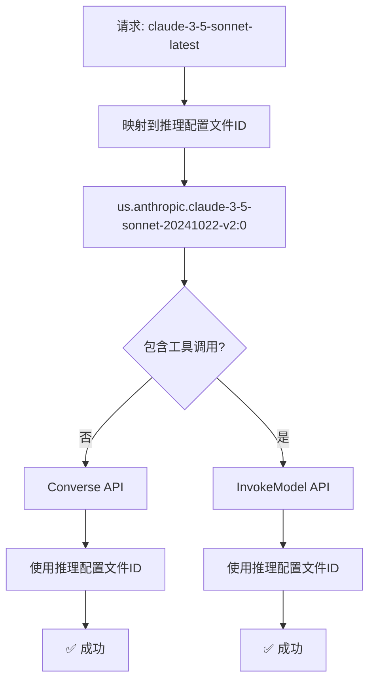

# AWS Bedrock 推理配置文件通用要求

## 🚨 重要发现

通过深入研究AWS官方文档，发现了一个关键事实：

**新版本Claude模型（3.5+）在所有AWS Bedrock API中都必须使用推理配置文件ID！**

## 📚 官方文档证据

### AWS InvokeModel API 官方示例

```bash
POST /model/us.anthropic.claude-3-5-sonnet-20240620-v1:0/invoke HTTP/1.1

{
    "anthropic_version": "bedrock-2023-05-31",
    "max_tokens": 1024,
    "messages": [
        {
            "role": "user",
            "content": [
                {
                    "type": "text",
                    "text": "Hello world"
                }
            ]
        }
    ]
}
```

**关键信息**：
- 模型ID：`us.anthropic.claude-3-5-sonnet-20240620-v1:0`（推理配置文件ID）
- API：InvokeModel
- 结论：InvokeModel API也使用推理配置文件ID！

## 🔍 错误分析回顾

### 原始错误
```
ValidationException: Invocation of model ID anthropic.claude-3-5-sonnet-20241022-v2:0 with on-demand throughput isn't supported. Retry your request with the ID or ARN of an inference profile that contains this model.
```

### 错误原因
我之前的理解是错误的：
- ❌ **错误假设**：Converse API用推理配置文件ID，InvokeModel API用直接模型ID
- ✅ **正确事实**：新版本Claude模型在**所有API**中都必须使用推理配置文件ID

## 🛠️ 正确的解决方案

### 统一模型ID策略

```go
// 正确的实现：所有API都使用推理配置文件ID
func convertToInvokeModelRequest(request *relaymodel.GeneralOpenAIRequest, modelID string) (*bedrockruntime.ConverseInput, error) {
    // 重要：新版Claude模型在所有API中都需要推理配置文件ID
    // 保持相同的modelID（推理配置文件ID）以确保一致性
    return nil, errors.New("USE_INVOKE_MODEL_API:" + modelID)
}
```

### API选择与模型ID使用



## 📋 AWS Bedrock 模型ID要求总结

### 新版本模型（Claude 3.5+, Claude 4）
| 模型 | Converse API | InvokeModel API |
|------|-------------|----------------|
| Claude 3.5 Sonnet | 推理配置文件ID | 推理配置文件ID |
| Claude 3.5 Haiku | 推理配置文件ID | 推理配置文件ID |
| Claude 3.7 Sonnet | 推理配置文件ID | 推理配置文件ID |
| Claude 4 Opus | 推理配置文件ID | 推理配置文件ID |
| Claude 4 Sonnet | 推理配置文件ID | 推理配置文件ID |

### 旧版本模型（Claude 3早期版本）
| 模型 | Converse API | InvokeModel API |
|------|-------------|----------------|
| Claude 3 Haiku | 直接模型ID | 直接模型ID |
| Claude 3 Sonnet | 直接模型ID | 直接模型ID |
| Claude 3 Opus | 直接模型ID | 直接模型ID |

## 🔧 技术实现

### 统一的模型ID映射

```go
// 模型映射表（适用于所有API）
var modelMapping = map[string]string{
    // 新模型（使用推理配置文件ID）
    "claude-3-5-sonnet-20241022": "us.anthropic.claude-3-5-sonnet-20241022-v2:0",
    "claude-3-5-sonnet-latest":   "us.anthropic.claude-3-5-sonnet-20241022-v2:0",
    "claude-3-5-haiku-20241022":  "us.anthropic.claude-3-5-haiku-20241022-v1:0",
    
    // 旧模型（使用直接模型ID）
    "claude-3-haiku-20240307":    "anthropic.claude-3-haiku-20240307-v1:0",
    "claude-3-sonnet-20240229":   "anthropic.claude-3-sonnet-20240229-v1:0",
    "claude-3-opus-20240229":     "anthropic.claude-3-opus-20240229-v1:0",
}
```

### API选择逻辑

```go
// 智能API选择（模型ID保持一致）
if len(request.Tools) > 0 {
    // 有工具调用：使用InvokeModel API（但保持推理配置文件ID）
    return handleInvokeModelRequest(c, awsCli, request, modelID)
} else {
    // 无工具调用：使用Converse API
    return handleConverseRequest(c, awsCli, request, modelID)
}
```

## 🧪 测试验证

### 基础对话测试

```bash
curl -X POST http://localhost:3000/v1/chat/completions \
  -H "Authorization: Bearer your-token" \
  -H "Content-Type: application/json" \
  -d '{
    "model": "claude-3-5-sonnet-latest",
    "messages": [{"role": "user", "content": "Hello!"}]
  }'
```

**预期行为**：
- 映射到：`us.anthropic.claude-3-5-sonnet-20241022-v2:0`
- 使用：Converse API
- 结果：✅ 成功

### 工具调用测试

```bash
curl -X POST http://localhost:3000/v1/chat/completions \
  -H "Authorization: Bearer your-token" \
  -H "Content-Type: application/json" \
  -d '{
    "model": "claude-3-5-sonnet-latest",
    "messages": [{"role": "user", "content": "What is the weather?"}],
    "tools": [{"type": "function", "function": {"name": "get_weather"}}]
  }'
```

**预期行为**：
- 映射到：`us.anthropic.claude-3-5-sonnet-20241022-v2:0`
- 检测到工具调用
- 使用：InvokeModel API（仍使用推理配置文件ID）
- 结果：✅ 成功

## 💡 关键洞察

### AWS的设计理念

1. **推理配置文件的优势**：
   - 跨区域路由
   - 更好的可用性
   - 自动负载均衡
   - 成本优化

2. **统一要求的原因**：
   - 简化开发者体验
   - 确保一致的性能
   - 支持未来的功能扩展

### 开发者影响

1. **简化了架构**：不需要复杂的模型ID转换
2. **提高了一致性**：所有API使用相同的模型标识符
3. **减少了错误**：避免了API间的模型ID不匹配

## 🚀 部署和验证

### 1. 重新编译
```bash
go build -o one-api
```

### 2. 重启服务
```bash
./one-api --port 3000
```

### 3. 验证功能
- ✅ 基础对话（Converse API + 推理配置文件ID）
- ✅ 工具调用（InvokeModel API + 推理配置文件ID）
- ✅ 流式响应（两种API都支持）

## 🎯 最终结论

**AWS Bedrock的新版本Claude模型要求在所有API中使用推理配置文件ID**，这是AWS的统一策略，旨在提供更好的性能、可用性和开发者体验。

我们的混合API策略现在完全正确：
- 根据功能需求选择API（工具调用vs基础对话）
- 但在所有情况下都使用推理配置文件ID
- 确保了最佳的兼容性和性能

这个发现解决了工具调用的最后一个障碍！🎉
